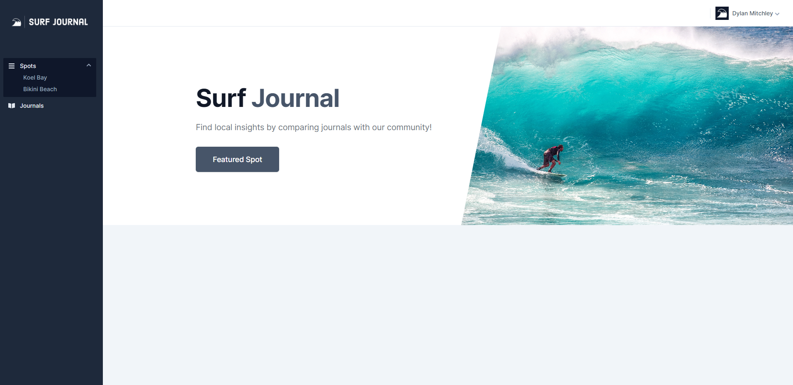
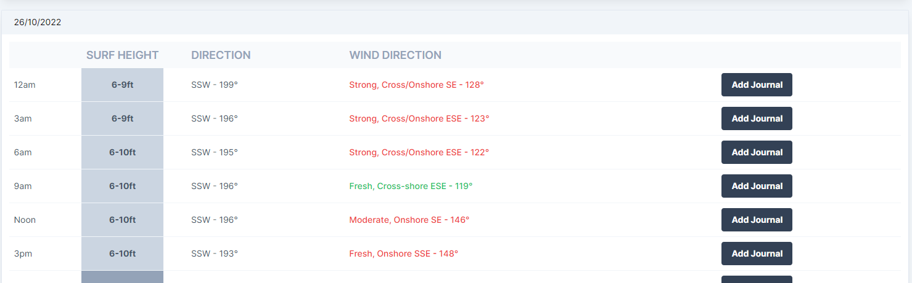
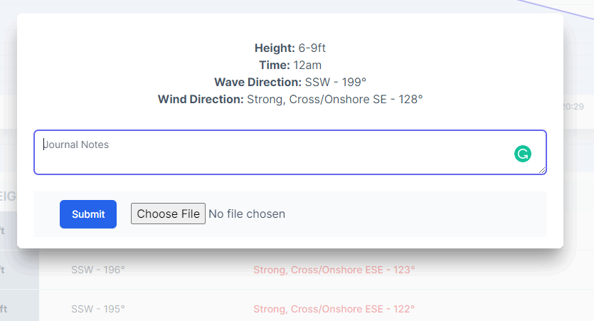
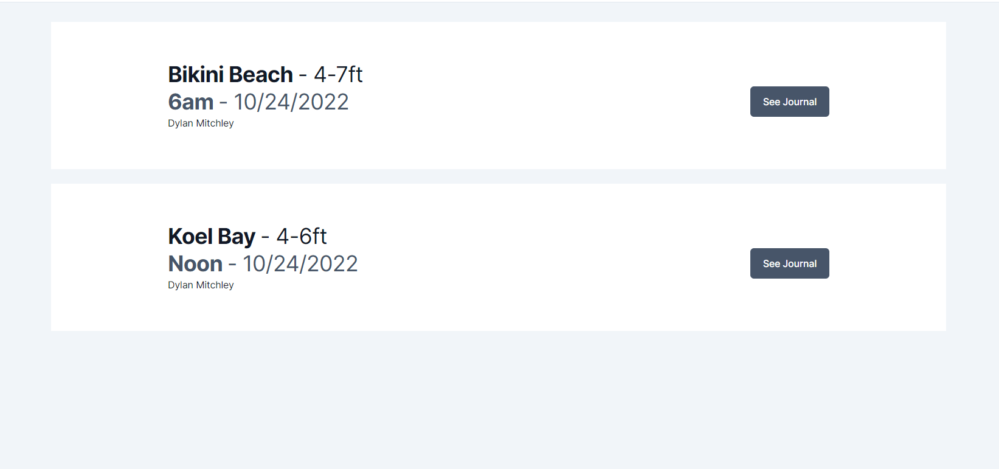
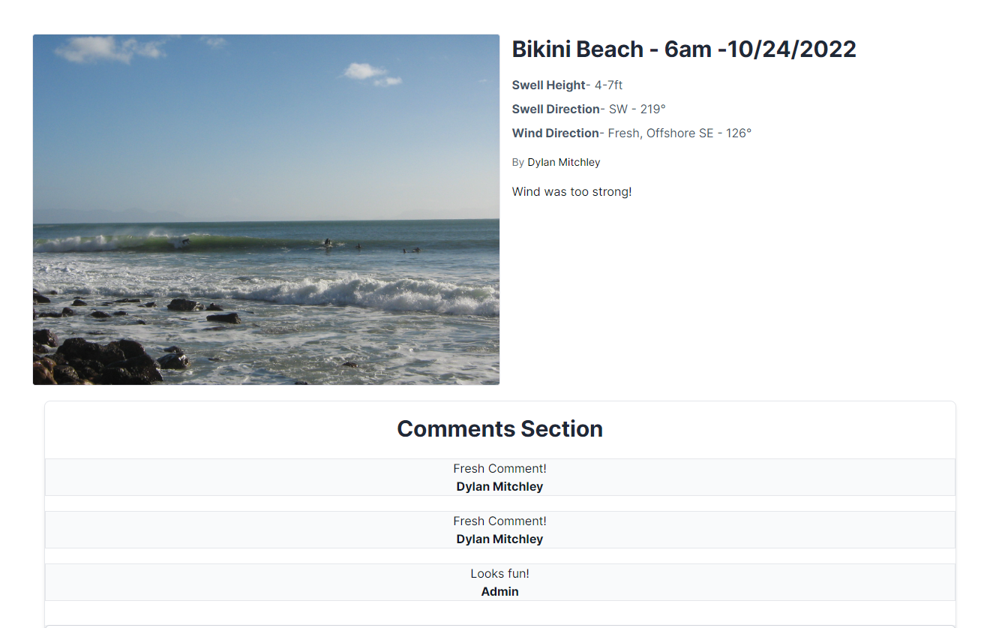
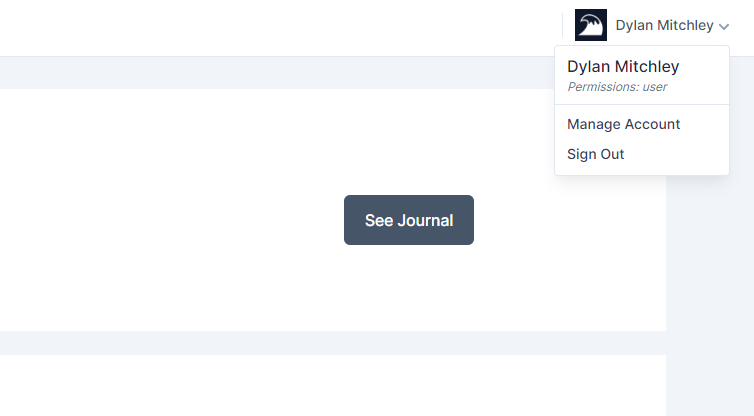
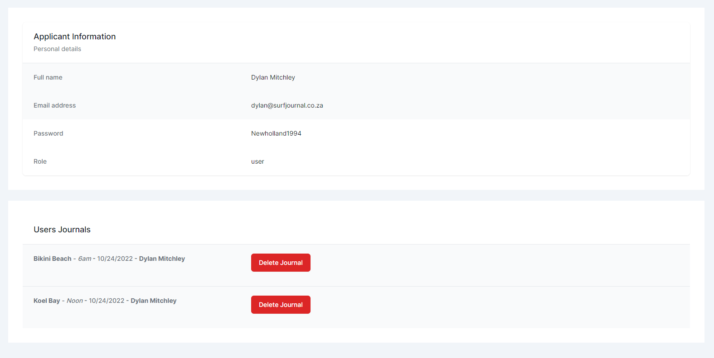

# Welcome to Surf Journal!

This application is a way for **Surfers** to form patterns of when surf spots have optimum conditions. They can browse through the journals tab of their desired surf spot and get an idea of how the upcoming report will relate to what the Journals say. This is a way to get local knowledge without knowing the locals. The surf report information is web scraped from the magicseaweed.com website. I wanted to marry www.wannasurf.com and surfline.com. I see a gap in the market where surfers can get better forecasting with the marriage of human feedback (Journals) and digital forecasting (MagicSeaweed Report).

# Run App Locally and admin Details

> Run `npm start` in the root directory to install all dependencies and start the app.

### Admin Login Details

> `fullname`: `Admin`

> `email`: `admin@surfjournal.co.za`

> `password`: `qwerty12345`

### Link to the live website

<a href="https://surf-journal.vercel.app/">Link to Surf Journal</a>

# How to use the App

The first page you will land on is the login page. If you do not have an account please visit the registration page.

You will then land on the home page. You can then select a spot on the sidebar menu.

To make a Journal select the button called add Journal and add your comments and image.

You will then be presented with the Journals page. If you click on the see journal image you will see more information about that specific journal and be able to make comments.

 

## Account page

To manage your journals see the dropdown and select manage account where you will be able to delete personal journals and see your account information. If you are an admin user you will be able to delete any users or journals you wish.

 

  

How to install and Test on your local computer

- Run git clone https://github.com/dmitchley/Surf-Journal.git

- Run `npm install` on the source and frontend directories.

- Create a .env file in the root directory and add your personal mongo db uri etc.

> NODE_ENV=development

> PORT=5000

> MONGO_URL=**YourURLGoesHere**

> JWT_SECRET=**YourSECRETGoesHere**

- To start the app run - `npm run dev` and wait for it to start. If all is done correctly you will see a link to the frontend that looks like the link below.

- ➜ Local: http://127.0.0.1:5176/

### Testing

- To test the backend run `npm run test` from the root directory.

- To test the frontend run `npm run test` from the frontend directory.

## Security Measures

The app uses jwt tokens that are validated by the backend every time a user signs in and this ensures security. I have hidden all the important keys in a .env file in the backend file to ensure no one can get hold of my mongo db url.

## Api

I could not unfortunately get a proper api endpoint for the surf report data. I decided to web scrape the magicseaweed website.

## Deployment

I originally planned to deploy the app to Heroku however they do not have a free tier anymore so I used render.com for the backend and vercel.com for the frontend. Render apparently offers options to deploy a frontend application however I am more accustomed to using vercel so I chose them instead.

- Link to the application
